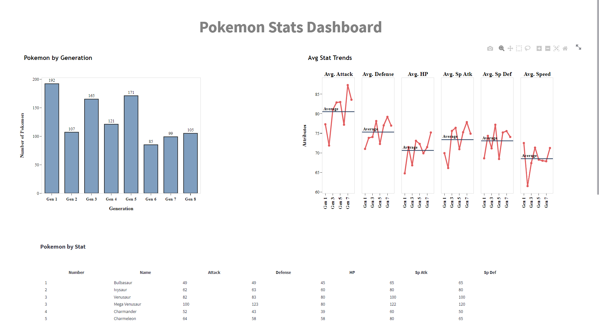

# Pokemon Dashboard with Plotly and Streamlit

## 📋 About

To showcase my skills with Streamlit and Plotly, I tried to recreate a [Tableau Dashboard](https://public.tableau.com/views/PokemonStatsDashboard/PokemonStatsDashboard?%3Aembed=y&%3AshowVizHome=no&%3Adisplay_count=y&%3Adisplay_static_image=y&%3AbootstrapWhenNotified=true) made by [Osmany](https://public.tableau.com/app/profile/osmany).

## 🔎 Data 

Since the dashboard only included data up to Generation 6, I decided to use updated data. My dashboard includes data up to **Generation 8**.

The [data source](https://www.kaggle.com/datasets/mariotormo/complete-pokemon-dataset-updated-090420/metadata) comes from Kaggle which was created by the user [Mario Tormo Romero](https://www.kaggle.com/mariotormo).

# 🔮 Final Output

Even though I was not able to replicate the dashboard 1 to 1, I was able to add a lot of the details from the original dashboard. This is just a small project to showcase my skills and what am capable of.

To see my Dashboard please click [here](https://cholu6768-pokemon-dashboard-pokemon-dashboard-hpzh9i.streamlitapp.com/).

